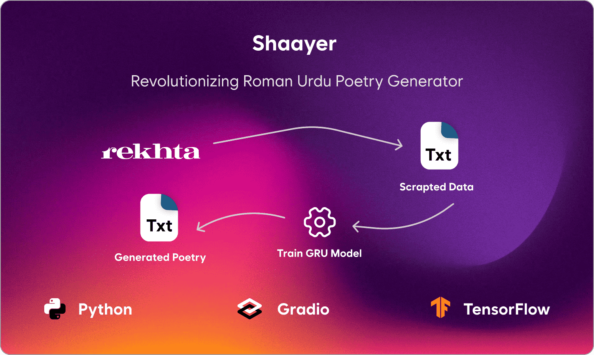
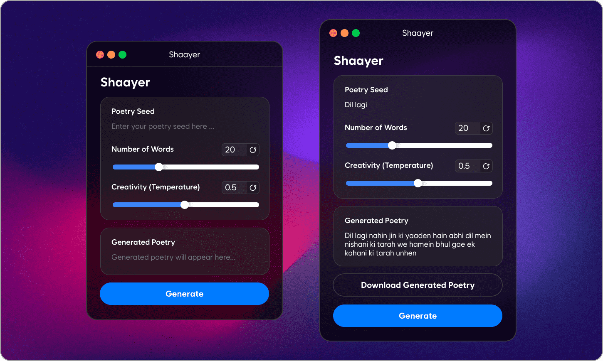

# Shaayer
Shaayer is an AI-powered **poetry generator** trained on Roman Urdu poetry scraped from **Rekhta**. It utilizes Natural Language Processing (NLP) and a **GRU**-based deep learning model to generate poetry based on a given seed word and desired length.

**[Live Demo](https://huggingface.co/spaces/mmohsin7/Shaayer)**

# **Shaayer - Roman Urdu Poetry Generator** 🎭📜

**Shaayer** is an AI-powered poetry generator trained on **Roman Urdu poetry** scraped from [Rekhta](https://rekhta.org). It utilizes **Natural Language Processing (NLP) and a GRU-based deep learning model** to generate poetry based on a given seed word and desired length.

## Features
- **Scrapes Roman Urdu poetry** from `Rekhta` using `BeautifulSoup`.
- **Cleans and tokenizes** the text for training.
- **Trains a GRU model** for poetry generation.
- **Gradio-powered UI** for easy interaction.
- **Customizable output:** Users enter a seed and select the number of words.

## Get Started
1. **Scraping**: The project extracts poetry data from `Rekhta`.
2. **Preprocessing**: The text is cleaned and tokenized.
3. **Training**: A `GRU-based` deep learning model is trained on the dataset.
4. **Generation**: The model predicts and generates poetry based on user input.
5. **Gradio App**: A web interface allows users to generate poetry interactively.

## Tech Stack
- **Python** (Data Processing & Model Training)
- **BeautifulSoup** (Web Scraping)
- **TensorFlow / Keras** (GRU Model & Tokenizer)
- **Gradio** (User Interface)
- **Pickle** (Saving Tokenizer)

## Future Enhancements
- Deploy as a web app for broader accessibility.
- Improve model accuracy with more training data.
- Add different poetry styles and structures.

## Output

